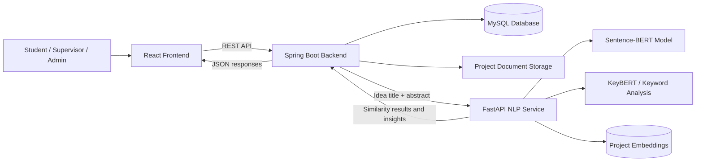

<div align="center">

# AI-Powered Research Project Repository and Idea Validation System

### A centralized academic repository with semantic project-idea validation, research analytics, and role-based project management


\

</div>

## Overview

The **AI-Powered Research Project Repository and Idea Validation System** is a full-stack academic platform designed for the Department of Computer Science, Trincomalee Campus, Eastern University, Sri Lanka.

The system centralizes completed final-year research projects and helps students evaluate new project ideas before implementation. Instead of relying only on keyword matching, the proposed AI service uses **Sentence-BERT embeddings** and **cosine similarity** to identify semantically related projects, estimate similarity, and highlight possible duplication.

The platform also supports project discovery, supervisor review, approval workflows, role-based dashboards, research-trend visualization, keyword extraction, and research-gap analysis.

> **Repository status:** The uploaded repository currently contains the React frontend prototype. Authentication, project uploads, approval workflows, dashboards, and idea validation currently use local or mock data. Spring Boot, MySQL, and FastAPI integration are part of the full-system implementation roadmap.

## Problem Statement

Universities often store final-year research projects across separate physical documents, personal drives, or disconnected systems. This makes it difficult to:

* discover previously completed projects;
* determine whether a proposed idea is genuinely original;
* prevent repeated or highly similar project topics;
* identify academic trends and underexplored research areas;
* manage project submissions, reviews, and approvals consistently.

This project addresses these limitations through a centralized repository enhanced with semantic NLP analysis and academic workflow management.

## Objectives

* Digitally store and organize final-year research projects.
* Provide searchable and filterable access to previous academic work.
* Evaluate new project ideas against repository abstracts.
* Detect semantic similarity beyond exact keyword matches.
* Support student, supervisor, and administrator workflows.
* Generate useful analytics on departments, technologies, topics, and years.
* Identify underrepresented areas and potential research gaps.
* Encourage originality, academic integrity, and informed project selection.

## Core Features

### Project Repository

* Browse completed projects through a centralized interface.
* Search by project title, abstract, department, batch, keyword, or tag.
* Filter projects using structured metadata.
* View project descriptions, team members, supervisors, technologies, tags, documentation, and repository links.

### Project Submission Workflow

* Students can submit project metadata and supporting documents.
* A standard documentation template can be downloaded from the upload page.
* Submitted projects enter a supervisor-approval workflow.
* Supervisors can review, approve, reject, rate, and comment on projects.

### AI-Powered Idea Validation

* Submit a proposed project title and abstract.
* Convert text into semantic vector embeddings using Sentence-BERT.
* Compare the proposed idea with existing project abstracts using cosine similarity.
* Return the most similar projects and their similarity percentages.
* Classify an idea as potentially duplicated or sufficiently original using a configurable threshold.

### Research Analytics

* Project count by department and year.
* Topic and category distributions.
* Popular technologies and keywords.
* Research-trend visualization.
* Word-cloud generation.
* Underexplored-topic and research-gap insights.

### Role-Based Access

| Role              | Main Capabilities                                                                 |
| ----------------- | --------------------------------------------------------------------------------- |
| **Student**       | Browse projects, submit projects, validate ideas, and view research analytics     |
| **Supervisor**    | Review submissions, approve or reject projects, add ratings, and provide feedback |
| **Administrator** | Manage users, approve accounts, monitor projects, and view system-wide analytics  |

## System Architecture



### Idea-Validation Request Flow

1. A student submits a title and abstract through the React interface.
2. The Spring Boot backend validates the request and sends the idea to the FastAPI service.
3. The NLP service generates a Sentence-BERT embedding for the submitted text.
4. The embedding is compared with stored project embeddings using cosine similarity.
5. The service ranks the closest projects and calculates similarity percentages.
6. The backend stores the validation result and returns it to the frontend.
7. The student receives the closest matches, originality status, and optional research-gap insights.

## AI and NLP Methodology

### Semantic Embeddings

The recommended model is:

```text
sentence-transformers/all-MiniLM-L6-v2
```

This model maps project titles and abstracts into dense numerical vectors that capture semantic meaning.

### Cosine Similarity

Similarity between a proposed idea vector `A` and an existing project vector `B` is calculated as:

```text
cosine_similarity(A, B) = (A · B) / (||A|| × ||B||)
```

A higher score indicates stronger semantic similarity. The final duplication threshold should be determined through validation with real departmental project data rather than treated as a universal constant.

### Keyword and Gap Analysis

The extended NLP pipeline can use KeyBERT or a comparable keyword-extraction method to:

* generate searchable project tags;
* identify frequent research themes;
* detect topics with limited representation;
* suggest potentially valuable research directions.

## Technology Stack

| Layer              | Technologies                                                  |
| ------------------ | ------------------------------------------------------------- |
| Frontend           | React 18, React Router, Tailwind CSS, Ant Design              |
| Data Visualization | Chart.js, React Chart.js 2, React D3 Cloud                    |
| HTTP Client        | Axios / Fetch API                                             |
| Backend            | Java, Spring Boot 3, Spring Web, Spring Data JPA              |
| Security           | Spring Security, role-based authorization, JWT authentication |
| AI Microservice    | Python, FastAPI, Sentence Transformers, scikit-learn          |
| NLP                | Sentence-BERT, cosine similarity, KeyBERT                     |
| Database           | MySQL 8                                                       |
| File Storage       | Local file storage or an object-storage service               |
| Build Tools        | npm, Maven                                                    |
| Version Control    | Git and GitHub                                                |

## Current Frontend Implementation

The React prototype includes:

* public landing page;
* authentication modal and session persistence;
* private and role-restricted routes;
* student dashboard;
* supervisor dashboard and approval pages;
* administrator dashboard, user management, and account approvals;
* searchable and filterable project repository;
* project-details page;
* project-upload form;
* downloadable documentation template;
* idea-comparison prototype;
* analytics charts and word clouds;
* mock-data and local-storage workflows.

### Important Development Note

The current authentication implementation reads sample users from a public JSON file and stores session or signup data in browser local storage. This is suitable only for interface prototyping.

Production deployment must replace it with:

* backend authentication;
* hashed passwords;
* secure access and refresh tokens;
* server-side authorization;
* protected database records;
* secure account-approval workflows.

## Repository Structure

```text
project-repository-and-validation-system/
└── research-repo-frontend/
    ├── public/
    │   ├── users.json
    │   └── pendingSignups.json
    ├── src/
    │   ├── Pages/
    │   │   ├── Home.jsx
    │   │   ├── Projects.jsx
    │   │   ├── ProjectDetails.jsx
    │   │   ├── Upload.jsx
    │   │   ├── IdeaComparisonPage.jsx
    │   │   ├── StudentDashboard.jsx
    │   │   ├── SupervisorDashboard.jsx
    │   │   └── AdminDashboard.jsx
    │   ├── assets/
    │   ├── components/
    │   │   ├── admin/
    │   │   ├── cards/
    │   │   ├── Filters/
    │   │   ├── Lecturer/
    │   │   ├── Navigation/
    │   │   └── student/
    │   ├── context/
    │   │   └── AuthContext.js
    │   ├── data/
    │   ├── routers/
    │   │   ├── PrivateRoute.js
    │   │   └── routers.js
    │   ├── App.js
    │   └── index.js
    ├── package.json
    ├── tailwind.config.js
    └── postcss.config.js
```

## Getting Started

### Prerequisites

Install the following software:

* Node.js 18 or later
* npm 9 or later
* Git

The full integrated system will additionally require:

* Java 17 or later
* Maven 3.9 or later
* Python 3.10 or later
* MySQL 8

### Clone the Repository

```bash
git clone https://github.com/Pasinduthennakoon/project-repository-and-validation-system.git
cd project-repository-and-validation-system/research-repo-frontend
```

### Install Frontend Dependencies

```bash
npm install
```

For reproducible installation using the dependency lock file:

```bash
npm ci
```

### Start the Development Server

```bash
npm start
```

Open the application at:

```text
http://localhost:3000
```

### Create a Production Build

```bash
npm run build
```

### Run Tests

```bash
npm test
```

## Proposed Backend API

The following endpoints represent the intended integration contract.

### Projects

```http
GET    /api/projects
GET    /api/projects/{id}
GET    /api/projects/filter
POST   /api/projects
PUT    /api/projects/{id}
DELETE /api/projects/{id}
```

### Project Review and Approval

```http
GET  /api/projects/pending
POST /api/projects/{id}/approve
POST /api/projects/{id}/reject
POST /api/projects/{id}/reviews
GET  /api/projects/{id}/reviews
```

### Idea Validation

```http
POST /api/ideas/analyze
GET  /api/ideas/history
GET  /api/ideas/{id}
```

Example request:

```json
{
  "title": "AI-Powered Student Support Assistant",
  "abstract": "A conversational system that provides personalized academic guidance to university students.",
  "department": "Computer Science",
  "batch": "2026"
}
```

Example response:

```json
{
  "status": "POTENTIALLY_SIMILAR",
  "highestSimilarity": 0.84,
  "threshold": 0.75,
  "topMatches": [
    {
      "projectId": 17,
      "title": "Intelligent Student Support Chatbot",
      "similarity": 0.84
    }
  ],
  "keywords": [
    "student support",
    "chatbot",
    "academic guidance"
  ]
}
```

### Analytics

```http
GET /api/dashboard/summary
GET /api/dashboard/projects-by-department
GET /api/dashboard/projects-by-year
GET /api/dashboard/technology-trends
GET /api/dashboard/research-gaps
GET /api/dashboard/keywords
```

## Proposed Data Model

Main entities include:

* `User`
* `Student`
* `Project`
* `PendingProject`
* `Review`
* `IdeaValidation`
* `Tag`

Key relationships:

* a student can submit multiple projects and ideas;
* a project can have multiple students and supervisors;
* a project can receive multiple reviews;
* an idea-validation record can reference one or more similar projects;
* projects can contain multiple tags and technologies.

## Development Roadmap

* [x] Responsive React interface
* [x] Project browsing and client-side filtering
* [x] Role-based frontend routing
* [x] Student, supervisor, and administrator dashboards
* [x] Local project-submission and approval prototype
* [x] Analytics and visualization components
* [x] Mock idea-comparison interface
* [x] Spring Boot REST API integration
* [x] MySQL persistence
* [x] Secure JWT-based authentication and authorization
* [x] Project-document upload and storage service
* [x] FastAPI Sentence-BERT similarity service
* [x] Precomputed project embeddings
* [x] KeyBERT tag generation
* [x] Research-gap insight service
* [x] Automated backend, frontend, and integration tests
* [x] Docker-based deployment
* [x] Continuous integration and continuous deployment

## Testing Strategy

The completed platform should include:

* unit tests for React components and utility functions;
* backend service and repository tests;
* API integration tests;
* authentication and authorization tests;
* NLP similarity tests using known similar and dissimilar project pairs;
* threshold evaluation using manually reviewed departmental data;
* end-to-end tests for submission, approval, validation, and review workflows.

## Security Considerations

Before production deployment:

* remove plaintext sample credentials from public assets;
* hash passwords using BCrypt or Argon2;
* use short-lived access tokens and secure refresh-token handling;
* enforce authorization on the backend rather than only in React routes;
* validate file type, file size, and document content during uploads;
* protect APIs using CORS, rate limiting, and request validation;
* keep secrets outside source control using environment variables;
* log administrative actions and project-approval decisions.

## Future Enhancements

* Compare proposed ideas with IEEE, Google Scholar, or Crossref records.
* Add full-document semantic and plagiarism analysis.
* Integrate a vector database or FAISS index for large-scale retrieval.
* Add multilingual abstract analysis.
* Generate personalized project suggestions by department and interest.
* Add an academic assistant for refining research questions and objectives.
* Enable cross-department or cross-university repository federation.
* Add email notifications for approvals, rejections, and review updates.

## Academic Impact

The system is intended to:

* reduce accidental duplication of final-year project topics;
* improve access to previous academic work;
* support evidence-based supervision and project selection;
* encourage students to explore original and underrepresented topics;
* create a reusable institutional knowledge base;
* strengthen academic integrity and research quality.

## Contributing

Contributions, issue reports, and feature proposals are welcome.

1. Fork the repository.
2. Create a feature branch.

```bash
git checkout -b feature/your-feature-name
```

3. Commit your changes.

```bash
git commit -m "feat: describe your change"
```

4. Push the branch.

```bash
git push origin feature/your-feature-name
```

5. Open a pull request with a clear description and testing evidence.

## Author

**Pasindu Piyumantha Thennakoon**
BSc in Computer Science
Department of Computer Science
Trincomalee Campus, Eastern University, Sri Lanka

## License

A license file is not currently included in the repository. Add an appropriate open-source or institutional license before public distribution or third-party reuse.

## Acknowledgements

* Department of Computer Science, Trincomalee Campus
* Project supervisors, reviewers, and academic staff
* Sentence Transformers and the open-source NLP community
* React, Spring Boot, FastAPI, MySQL, Tailwind CSS, and Chart.js communities

---

<div align="center">

**Building a smarter academic repository for original, discoverable, and data-informed research.**

</div>

